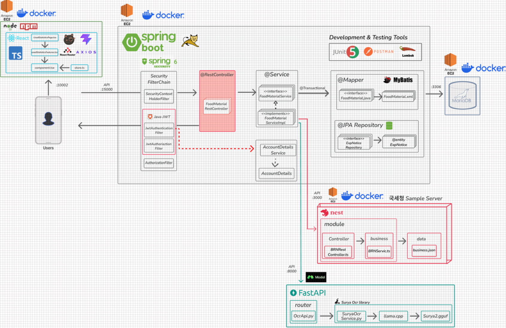
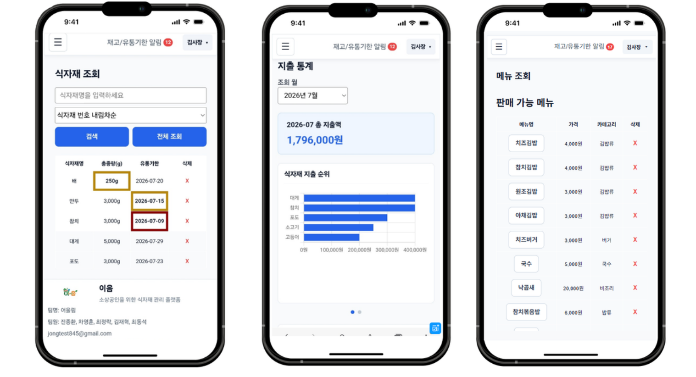
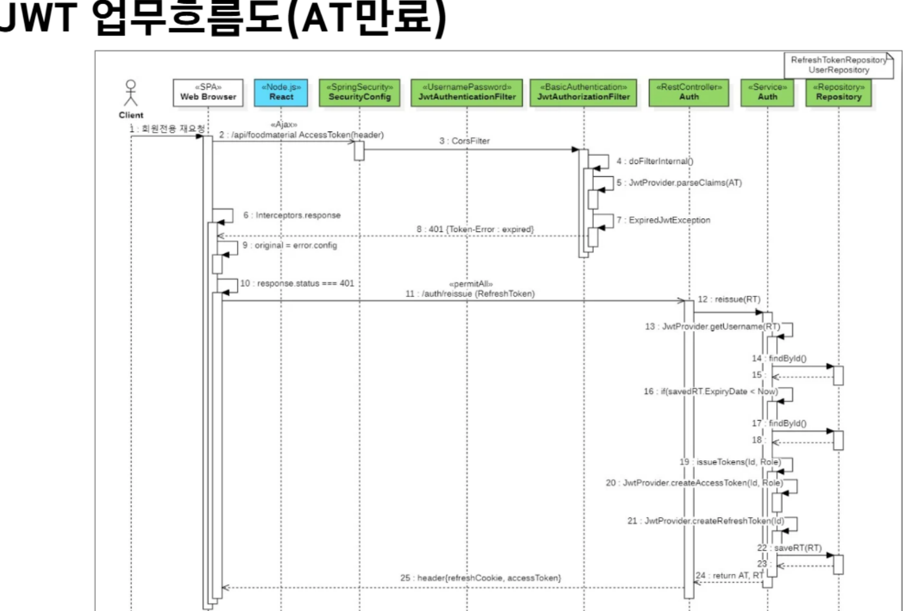

# EUM 🍽️ — 소상공인 식자재 관리 ERP Frontend

> Thymeleaf 기반 화면을 React SPA로 전환하고 Spring Boot REST API와 분리한 3차 스프린트 프론트엔드입니다.  
> 식자재·메뉴·지출 통계 화면을 중심으로 데스크톱과 모바일 UI를 구현하고, Axios 공통 클라이언트를 통해 인증이 필요한 API를 호출합니다.


---

## 📌 프로젝트 개요

| 항목 | 내용 |
| --- | --- |
| 기간 | **2026.06.25 ~ 2026.07.08** |
| 인원 | 5명 |
| 형태 | 애자일 스프린트 기반 팀 프로젝트 |
| 목표 | Thymeleaf SSR 화면을 React SPA로 전환하고 Spring Boot REST API와 UI 서버 분리 |
| 인증 연동 | Access Token 요청 헤더·Refresh Token HttpOnly 쿠키 기반 JWT 연동 |
| 개인 역할 | **식자재 조회, 메뉴 조회·판매, 지출 통계, 모바일 대응, 공통 Input 스타일** |

> JWT 발급·검증 백엔드는 팀원이 구현했습니다. 개인 구현 범위는 React 담당 화면과 REST API 연동이며, JWT 흐름은 소스 분석과 별도 실습으로 검증합니다.

---

## 🏗️ 시스템 아키텍처



```text
Browser
   ↓ :10002
React SPA · TypeScript · Vite
   ↓ Axios / REST API
Spring Boot Backend :15000
   ↓
MyBatis · JPA · MariaDB
```

개발 환경에서는 Vite가 `/api` 요청을 `http://localhost:15000`으로 프록시합니다. 현재 공개 소스의 패키지 버전은 스프린트 발표 당시 버전과 일부 다를 수 있으며, 아래 기술 스택은 현재 `package.json`을 기준으로 정리했습니다.

---

## 👨‍💻 개인 구현 범위



| 영역 | 구현 내용 | 핵심 기술 |
| --- | --- | --- |
| 식자재 조회 | 검색·정렬·10개 단위 추가 조회·선택 삭제·알림 색상 | React State, Axios, TypeScript |
| 메뉴 조회 | 목록·사용 식자재 상세·판매 요청·재고 부족 오류 처리 | REST API, 상태 분리, `@Transactional` 백엔드 연동 |
| 지출 통계 | 월별 조회·요약·카테고리 순위·차트 슬라이더 | Custom Hook, Chart.js, Swiper |
| 모바일 대응 | PC 표와 모바일 카드의 정보 우선순위 분리 | Media Query, 반응형 CSS |
| 공통 UI | 반복 입력 요소의 공통 Input 적용과 페이지별 스타일 조정 | Props, 공통 컴포넌트, CSS |

### 책임 경계

- **직접 구현:** 식자재·메뉴·지출 통계 React 화면, 담당 API 호출, 모바일 UI, 색상 알림 표시
- **팀원 구현:** JWT 발급·검증 백엔드, 로그인·회원가입, 다른 업무 화면
- **팀 통합:** 공통 Header·Sidebar·Button·Input, 라우팅, Axios 클라이언트, API 응답 형식

---

## 🥬 식자재 조회

### 데이터 흐름

```text
FoodMaterialsPage
    ↓ GET /api/foodmaterials
Axios 공통 Client
    ↓ Authorization Header
Spring Boot REST API
    ↓ JSON
식자재 목록·페이지 정보·알림 설정 반영
```

### 구현 포인트

- 검색어·정렬 기준·페이지 번호를 Query Parameter로 전달했습니다.
- 첫 요청은 10개를 조회하고 이후 페이지를 이어 붙이는 방식으로 목록을 확장했습니다.
- 유통기한·재고 알림 설정을 함께 조회해 정상·주의·위험 상태를 화면 색상으로 구분했습니다.
- 데스크톱에서는 전체 열을 표로 제공하고 모바일에서는 식자재명·총중량·유통기한·삭제 등 우선 정보만 표시했습니다.
- 삭제 후 목록을 다시 요청해 서버 데이터와 화면 상태를 맞췄습니다.

| Method | Endpoint | 용도 |
| --- | --- | --- |
| `GET` | `/api/foodmaterials` | 검색·정렬·페이지 단위 식자재 조회 |
| `DELETE` | `/api/foodmaterials/{id}` | 식자재 삭제 |
| `GET` | `/api/notice/exp` | 유통기한 알림 설정 조회 |
| `GET` | `/api/notice/stock` | 재고 알림 설정 조회 |

---

## 🍽️ 메뉴 조회·판매

```text
메뉴 목록 조회
    ↓ 메뉴 선택
사용 식자재 상세 조회
    ↓ 판매 수량·결제 수단 입력
판매 API 요청
    ↓
성공 메시지 또는 재고 부족·서버 오류 표시
```

- 메뉴 목록과 선택 메뉴의 사용 식자재 상태를 분리했습니다.
- 판매 수량이 1 미만인 요청은 프론트엔드에서 먼저 차단합니다.
- 사용자의 판매 확인 후 `{ saleCount, payment }`를 JSON으로 전송합니다.
- 판매 성공 뒤 사용 식자재를 다시 조회해 차감된 재고를 반영합니다.
- 메뉴 판매 시 식자재 재고 차감은 본인이 구현한 백엔드 흐름과 연동되며, 판매 기록·재고 부족 알림 생성은 팀원 구현입니다.

| Method | Endpoint | 용도 |
| --- | --- | --- |
| `GET` | `/api/menus` | 메뉴 목록 |
| `GET` | `/api/menus/{menuId}/materials` | 메뉴별 사용 식자재 |
| `POST` | `/api/menus/{menuId}/sales` | 판매 처리·재고 차감 |
| `DELETE` | `/api/menus/{menuId}` | 메뉴 삭제 |

---

## 📊 지출 통계

```text
조회 월 선택
   ↓
useUsedStatistics(month)
   ↓
월 지출 합계 · 카테고리 지출 순위 · 월별 추이
   ↓
요약 카드 · Chart.js · 순위 표
```

- API 요청과 화면 렌더링을 Custom Hook과 표시 컴포넌트로 분리했습니다.
- 선택한 월을 기준으로 지출 합계와 카테고리 순위를 표시합니다.
- 좁은 화면에서는 차트를 한 장씩 확인할 수 있도록 슬라이더 UI를 적용했습니다.

---

## 🔐 JWT 연동 구조



```text
로그인 성공
   ↓
Authorization 응답 헤더의 Access Token
   ↓ sessionStorage
Axios 요청 Interceptor
   ↓ Authorization: Bearer <token>
보호 API 호출

Access Token 만료 401 + Token-Status: expired
   ↓
POST /api/auth/reissue
   ↓ HttpOnly Refresh Token Cookie 자동 전달
새 Access Token 저장 → 원 요청 재시도
```

### 현재 소스의 저장 방식

| 항목 | 저장·전달 방식 |
| --- | --- |
| Access Token | `sessionStorage`의 `accessToken` 키에 `Bearer ...` 전체 문자열 저장 |
| Access Token 전달 | Axios 요청 인터셉터가 `Authorization` 헤더에 자동 주입 |
| Refresh Token | JavaScript에서 읽을 수 없는 HttpOnly 쿠키 |
| 자동 재발급 | 401과 `Token-Status: expired`를 함께 확인한 뒤 `/api/auth/reissue` 호출 |
| 동시 만료 요청 | 재발급 중인 요청 하나를 기준으로 나머지 요청을 대기열에 보관 |

> JWT 백엔드 구현은 개인 담당이 아닙니다. 이 저장소에서는 React의 토큰 저장·헤더 주입·재발급 요청 흐름을 확인할 수 있습니다.

---

## 🧩 컴포넌트와 상태 분리

| 구분 | 예시 | 역할 |
| --- | --- | --- |
| Page | `FoodMaterialsPage`, `MenuListPage`, `UsedStatisticsPage` | 라우트 단위 화면과 상태 조합 |
| Component | `Input`, `Button`, `Header`, `Sidebar` | 여러 화면에서 반복되는 UI |
| Feature | `notice`, `usedStatistics` | 기능 단위 API·표시 컴포넌트 |
| Hook | `useUsedStatistics`, `useNotice` | 비동기 상태와 재사용 로직 |
| API | `client.ts` | Axios 기본 설정·토큰·재발급 |
| Store | `userStore.ts` | 로그인 사용자 정보와 권한 상태 |
| Router | `ProtectedApp`, `ProtectedPage` | 로그인 여부·관리자 권한에 따른 접근 분기 |

### 회고와 개선 기준

- 초기에는 페이지 컴포넌트에 API·상태·화면 코드가 집중되어 파일이 커졌습니다.
- 지출 통계는 Hook·Feature로 분리하고 반복 입력 요소는 공통 컴포넌트로 옮겼지만, 식자재·메뉴 페이지에는 상태·API·렌더링 책임 집중이 남았습니다. 이를 후속 개선 기준으로 정리했습니다.
- 모든 요소를 무조건 공통화하기보다, 반복 사용 여부와 변경 영향 범위를 기준으로 분리할 필요가 있음을 배웠습니다.

---

## 🛠️ 기술 스택

| 구분 | 기술 |
| --- | --- |
| Language | TypeScript 6 |
| UI | React 19 |
| Build | Vite 8 |
| Routing | React Router 8 |
| State | React State, Zustand 5 |
| HTTP | Axios 1, Vite Proxy |
| Visualization | Chart.js 4, react-chartjs-2, Swiper |
| Styling | CSS, Media Query |
| Quality | ESLint, Prettier, Husky, lint-staged, Commitlint |
| Collaboration | Git, GitHub, Jira, Confluence |

---

## 🚀 실행 방법

### 1. 저장소 가져오기

```bash
git clone https://github.com/young-hoon2/eum.git
cd eum
```

### 2. 패키지 설치·실행

```bash
npm ci
npm run dev
```

- React 개발 서버: `http://localhost:10002`
- `/api` 프록시 대상: `http://localhost:15000`

정상 동작을 위해 Spring Boot 백엔드와 MariaDB가 함께 실행되어야 합니다.

### 3. 검증 명령

```bash
npm run build
npm run lint
```

---

## 📁 프로젝트 구조

```text
src
├─ api             # Axios 공통 클라이언트·인증 API
├─ assets          # 이미지·아이콘
├─ components      # 공통 UI 컴포넌트
├─ features        # 기능 단위 API·컴포넌트
├─ hooks           # 비동기 상태·재사용 로직
├─ pages           # 라우트 단위 페이지
├─ router          # 공개·보호·관리자 라우트
├─ store           # Zustand 사용자 상태
├─ types           # 공통 TypeScript 타입·DTO
└─ utils           # 날짜·표시 형식 등 공통 함수
```

---

## 🔗 관련 저장소

- [1차 Servlet/JSP·MyBatis 리팩토링](https://github.com/young-hoon2/KostaErp)
- [2·3차 Spring Boot 백엔드](https://github.com/young-hoon2/KostaErpServer)

